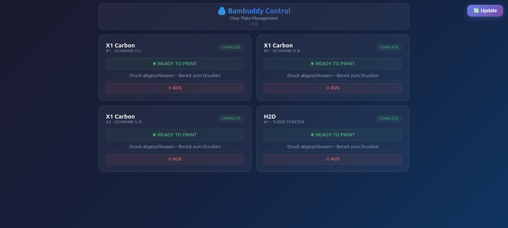

# 🖨️ Bambuddy Touch — Smart Printer Dashboard v1.0

Web-basiertes Interface zum Steuern von Bambu Lab Druckern über die API. Optimiert für Raspberry Pi mit 800×480 Touchscreen.

## ✨ Features

- **📊 Echtzeit-Status** aller Drucker auf einer Übersicht
- **⏻ Smart Plug Power Control** — Drucker ein/aus schalten über smarte Steckdosen
- **🧹 Clear Plate** — Druckplatte zurücksetzen per Knopfdruck
- **✅ Bestätigungsdialoge** — Verhindert versehentliche Aktionen
- **🎨 Dark Glassmorphism UI** — Modernes, dunkles Design mit Glasmorphismus-Effekten
- **📱 Touch-optimiert** — Perfekt für 800×480 Raspberry Pi Touchscreens
- **🔄 In-App Update** — Aktualisierung direkt aus der Oberfläche



## ⚠️ WICHTIG: Private Repo

Dieses Repository ist **privat**. Die `.env` Datei mit den API-Credentials wird **nicht** im Git gespeichert (`.gitignore`). Du musst sie manuell auf den Raspberry Pi kopieren!

---

## 📁 Dateien-Übersicht

| Datei | Zweck | Muss auf PI sein? | Wie kopieren |
|-------|-------|:-----------------:|--------------|
| `backend.py` | Python Proxy-Server (Port 8080) | ✅ Ja | Git clone oder manuell |
| `frontend.html` | Web-Oberfläche (Touch-optimiert) | ✅ Ja | Git clone oder manuell |
| `.env` | **API-Credentials** 🔐 | ✅ Ja | **Manuell erstellen!** |
| `.gitignore` | Schützt .env vor Git | ❌ Nein | Wird mit git clone mitgenommen |
| `README.md` | Diese Anleitung | ❌ Nein | Optional |
| `bambuddy-clearplate.service` | systemd Autostart | ❌ Nein | Manuell kopieren nach `/etc/systemd/system/` |

---

## 🚀 Installation auf Raspberry Pi

### Option 1: Git Clone (empfohlen)

```bash
# Repository klonen (privat — GitHub fragt nach Login)
cd /home/pi
git clone https://github.com/finnleyben-spec/Bambuddy_Touch.git
cd Bambuddy_Touch
```

### Option 2: Manuell kopieren

Lade die Dateien einzeln herunter oder kopiere sie per USB/SFTP:

```bash
# Verzeichnis erstellen
mkdir -p /home/pi/bambuddy-clearplate
cd /home/pi/bambuddy-clearplate

# Dateien hier ablegen:
# - backend.py
# - frontend.html
```

---

## 🔐 API-Credentials einrichten (manuell!)

Die `.env` Datei enthält deine sensiblen API-Keys und wird **nicht** im Git gespeichert. Du musst sie manuell auf den Raspberry Pi kopieren!

### Erstelle die .env manuell:

```bash
cd /home/pi/Bambuddy_Touch  # oder /home/pi/bambuddy-clearplate

cat > .env << 'EOF'
BAMBUDY_API_URL=https://DEINE-API-URL.de/api/v1
BAMBUDY_API_KEY=DEIN_API_KEY_HIER
EOF
```

**Ersetze `DEIN_API_KEY_HIER` durch deinen echten Bambu Studio API-Key!**

---

## 🏠 Autostart einrichten (systemd)

Damit der Server automatisch beim Systemstart startet:

```bash
# Service-Datei in systemd kopieren
sudo cp bambuddy-touch.service /etc/systemd/system/

# Daemon neu laden, aktivieren und starten
sudo systemctl daemon-reload
sudo systemctl enable --now bambuddy-touch

# Status prüfen
sudo systemctl status bambuddy-touch
```

### ⚠️ WICHTIG: Benutzer anpassen!

Die Service-Datei hat standardmäßig `User=pi`. Falls dein Raspberry Pi-Benutzer anders heißt (z.B. `raspberry`), musst du die Datei anpassen:

```bash
sudo sed -i 's/User=pi/User=<DEIN_BENUTZER>/' /etc/systemd/system/bambuddy-touch.service
sudo systemctl daemon-reload
sudo systemctl restart bambuddy-touch
```

### Logs anzeigen

```bash
sudo journalctl -u bambuddy-touch -f    # Live-Logs
sudo journalctl -u bambuddy-touch --since today  # Heute
```

---

## 🖥️ Kiosk-Modus (Touchscreen, Fullscreen)

**Wichtig:** systemd-Services und crontab `@reboot` funktionieren **nicht zuverlässig** für den Kiosk-Modus auf Raspberry Pi OS mit labwc Desktop. Der Bildschirm ist oft noch nicht bereit wenn der Service startet → "platform failed to initialize".

### ✅ Funktionierende Methode: labwc autostart

```bash
mkdir -p ~/.config/labwc
nano ~/.config/labwc/autostart
```

Folgende Zeile eintragen (URL anpassen):

```
sleep 5 && chromium --kiosk --noerrdialogs --disable-infobars --no-first-run --start-maximized "http://localhost:8080" &
```

Speichern mit **Strg+O**, Enter, **Strg+X**.

### Warum `sleep 5`?

Der Bildschirm braucht einen Moment bis er bereit ist. Ohne Verzögerung startet Chromium zu früh → Fehler.

### Kiosk stoppen (z.B. für Updates)

```bash
# Chromium beenden
pkill chromium

# Oder Neustart
sudo reboot
```

---

## 🔄 Software aktualisieren

### Einzeiler (empfohlen)
```bash
cd ~/Bambuddy_Touch && git pull origin master && sudo systemctl restart bambuddy-touch
```

### Manuell
```bash
# 1. Update holen:
cd ~/Bambuddy_Touch && git pull origin master

# 2. Server neu starten:
sudo systemctl restart bambuddy-touch

# 3. Browser: Strg + Shift + R (Hard Refresh)
```

---

## 🛠️ Troubleshooting

| Problem | Lösung |
|---------|--------|
| Server startet nicht | `sudo journalctl -u bambuddy-clearplate -n 50` prüfen |
| Port 8080 belegt | `netstat -tlnp \| grep 8080` — anderen Port in `backend.py` Zeile 168 anpassen |
| "Permission denied" | `sudo chmod 644 /etc/systemd/system/bambuddy-clearplate.service` |
| API-Fehler | Prüfe ob `.env` existiert: `cat .env` — sollte `BAMBUDY_API_KEY=...` enthalten |

---

## 🔒 Sicherheit

- ✅ **API-Credentials** bleiben auf dem Pi, nie im Browser sichtbar
- ✅ **Keine externen Abhängigkeiten** — nur Python Standardbibliothek
- ✅ **Lokaler Zugriff** — Server hört nur auf `127.0.0.1` (localhost)
- ✅ **Private Repo** — Credentials nicht in Git

---

## 📝 Lizenz

MIT License - Frei für private und kommerzielle Nutzung
